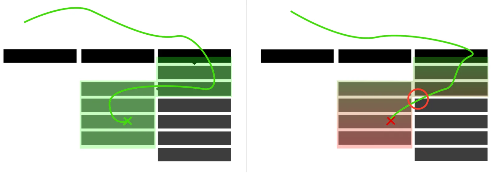

# 多级菜单 | multi level navigation

来思考下图多级菜单的鼠标移动路径

更多说明：https://www.smashingmagazine.com/2021/05/frustrating-design-patterns-mega-dropdown-hover-menus/

为了避免鼠标转那么多弯弯，亚马逊有用一个 menuaim 的插件 https://github.com/kamens/jQuery-menu-aim

这个项目已经很久了，为了抛开 jQ 我做了这个插件 https://github.com/postor/react-multilevel-menu-aim

在线体验 https://codesandbox.io/s/react-multilevel-menu-aim-kiosr

