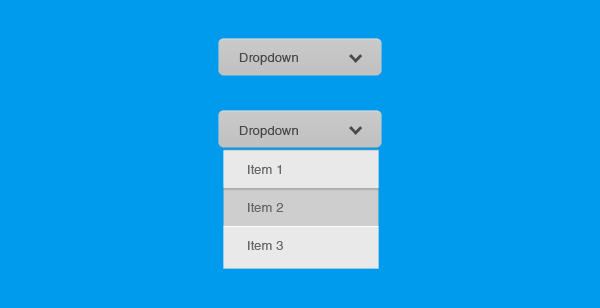
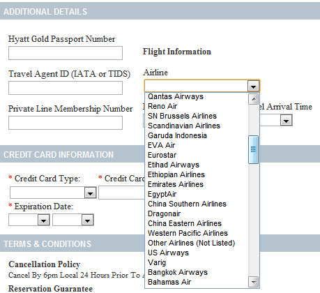
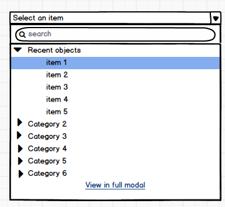
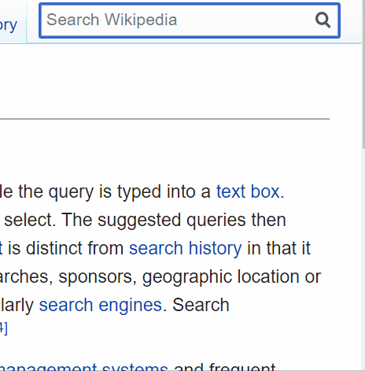

# 支持搜索的下拉框

## 原始 `select` 控件适合只有少数候选值得情况，可以使用 css 进行美化

纯 css 美化 `select` https://codepen.io/raubaca/pen/VejpQP

## 当候选值较多情况难以查找，可使用搜索或分组来优化

在很多候选中翻查想要的值非常考验耐心

分组/排序后有一定的优化效果

个人觉得体验较好的还是搜索

推荐组件/库
- react-select https://react-select.com/home
- antd select https://ant.design/components/select/
- select2 https://select2.org/dropdown

除了在候选达到一定量级就需要使用后台接口配合，否则等待接口数据就拖延了可交互时间，这就涉及到后台的搜索引擎，还需要控制接口调用频次和加载中状态
- 可交互时间 https://web.dev/i18n/zh/tti/
- 搜索引擎推荐 elasticsearch https://www.elastic.co/cn/
- 控制频次 throttle/debounce https://www.cnblogs.com/hity-tt/p/7852888.html

针对中文的环境还有个拼音搜索的优化
- 拼音插件 https://github.com/medcl/elasticsearch-analysis-pinyin
- 示例项目 https://github.com/postor/elasticsearch-node-example